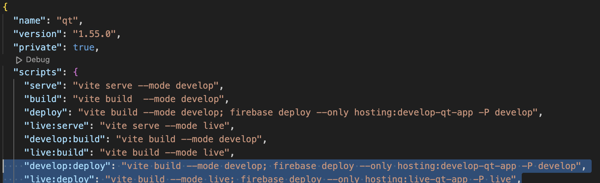

# Generate Preview URLs

Preview URLs can be manually generated by taking the following steps:

## QT

For QT you should go into one of the subdirectories.

1. For QT you should go into one of the subdirectories, eg for qt go into the qt directory (ie qt/qt on your machine)

2. Run `> npm run build`

3. Run the preview command, see: [Building The Preview Command](#building-the-preview-command)

## Admin/Apply/Assessments

1. Change NODE_ENV=development to NODE_ENV=production in .env.production.local and run: 

    > npm run production:build

2. Run: > firebase use production

3. Run: > firebase hosting:channel:deploy --only production-admin-app 1723-diversity --expires 30d

4. Revert above back to: NODE_ENV=development (in .env.production.local)

5. Run: > firebase use develop

## Building The Preview Command

The preview comman looks like this:

`> firebase hosting:channel:deploy --only <app-name-from-package.json> <approx-branch-name> --expires 30d`

Note that the \<app-name-from-package.json\> can be found in the package.json file and is the string immediately after 'hosting' for the command which deploys to the appropriate environment.

So, for the develop environment (in the snippet below), it is: develop-qt-app

---
