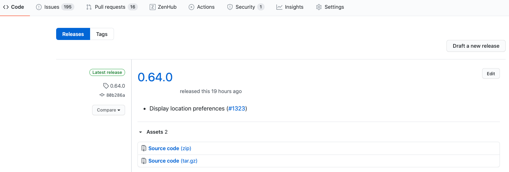
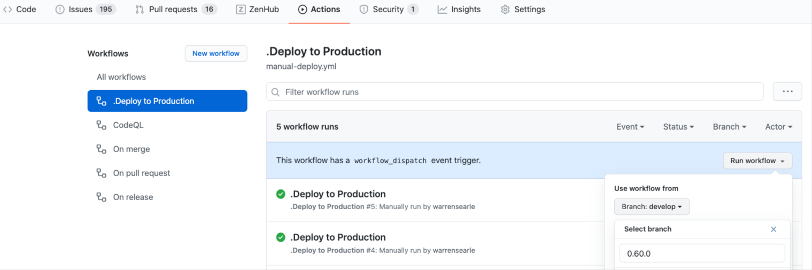

# Deployment

## Versioning
We use an adaptation of the Semantic Versioning Specification **MAJOR.MINOR.PATCH** adapted to our needs

**MAJOR** revision (new UI, lots of new features, conceptual change, etc.) - we don't change this very often

**MINOR** revision (maybe a change to a search box, 1 feature added, collection of bug fixes) - basically every daily release we increment this number

**PATCH** - bugfix - Whenever we do a hotfix, we increment this number between daily releases

## Release Process

1. Whenever changes are approved and merged the next draft release is updated.

2. When a draft release is published the changes are automatically deployed to Production.

3. To roll back or forwards to a specific version we use a manual Action called ‘Deploy to Production’.

After the release post these release notes to Slack channel **#digital-team** using the following format:

> @channel version **[VERSION]** has been released to **[APP]** production
> 2 issues / 16.5 sp
>
> https://**[APP]**.judicialappointments.digital/
>
> *#123 Add cancel button to sign up page
>
> *#124 Add log out button to header

Finally add the same message to the respective apply/admin section of the release notes email.

---
