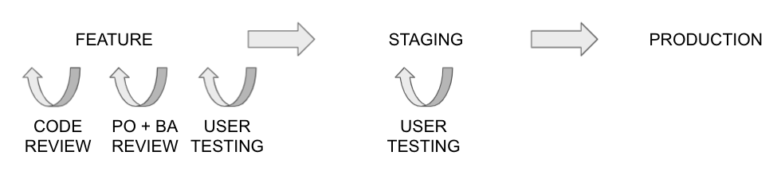
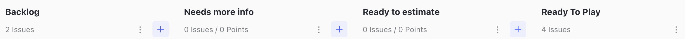
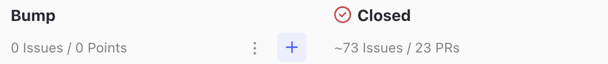

# Deployment

## Versioning
We use an adaptation of the Semantic Versioning Specification **MAJOR.MINOR.PATCH** adapted to our needs

**MAJOR** revision (new UI, lots of new features, conceptual change, etc.) - we don't change this very often

**MINOR** revision (maybe a change to a search box, 1 feature added, collection of bug fixes) - basically every daily release we increment this number

**PATCH** - bugfix - Whenever we do a hotfix, we increment this number between daily releases

## Release Process

We use Github Actions with the existing Github UI and follow Github Flow model for organising our source code, releases and hotfixes.

Benefits of the process:

* It is simple
* Early approval per feature
* Puts control in hands of whole team
* Can easily be refined

### ZenHub Board

### Sprint Planning

1. Issues are added to the 'Backlog' for a specific sprint.

2. During sprint planning issues are moved to the 'Ready To Estimate' column according to priority and whether they have enough information. Otherwise they go into the 'Need More Info' column (until more info has been added, at which point they go to 'Ready To Estimate').

3. Once in the 'Ready To Estimate' column the software development team members will take time to estimate complexity points for the ticket until a consensus is reached.

4. The complexity points are added to the ticket and it is moved to the 'Ready To Play' column.

### GitHub FLow

1. Developer takes their next ticket from top of the 'Ready To Play' column moving it to ‘In progress’ (or ‘Blocked’ if there is a problem).

2. Developer names the ticket according to the branch. See: [Git Branch Naming](developer-guide/git-branch-naming.md)

3. Works begins on coding the feature/bugfix.

3. When the development work is complete, they create a new Pull Request and move ticket to ‘Code Review’. They write test instructions for user testing and their work is automatically deployed to a preview URL. The setting for the preview url is located at the end of the pull request description and can be set to `PREVIEW:OFF, PREVIEW:DEVELOP or PREVIEW:STAGING`.

4. The 'Needs UT' label is added to the issue and to the pull request so that the code gets tested during the next round of user testing.

5. Once the pull request has passed user testing its status is changed to 'Passed UT'.

5. At any point from the pull request being created it needs 1+ approvals from in-house developers, both contractors, product owner and User Testing Group.

5. When the code review has been approved and the pull request ahs passed user testing the code can be merged into the main branch and gets automatically deployed to Staging.

6. Whenever changes are approved and merged the next draft release is updated.

7. When a draft release is published the changes are automatically deployed to Production.

8. To roll back or forwards to a specific version we use a manual Action called ‘Deploy to Production’.

After the release post these release notes to Slack channel **#digital-team** using the following format:

> @channel version **[VERSION]** has been released to **[APP]** production
> 2 issues / 16.5 sp
>
> https://**[APP]**.judicialappointments.digital/
>
> *#123 Add cancel button to sign up page
>
> *#124 Add log out button to header

Finally add the same message to the respective apply/admin section of the release notes email.

---
