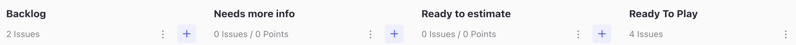
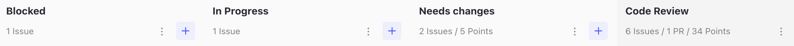
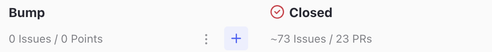

# Software Development Process

## ZenHub Board

## Sprint Planning

1. Issues are added to the 'Backlog' for a specific sprint.

2. During sprint planning issues are moved to the 'Ready To Estimate' column according to priority and whether they have enough information. Otherwise they go into the 'Need More Info' column (until more info has been added, at which point they go to 'Ready To Estimate').

3. Once in the 'Ready To Estimate' column the software development team members will take time to estimate complexity points for the ticket until a consensus is reached.

4. The complexity points are added to the ticket and it is moved to the 'Ready To Play' column.

## GitHub FLow

1. Developer takes their next ticket from top of the 'Ready To Play' column moving it to ‘In progress’ (or ‘Blocked’ if there is a problem).

2. Developer names the ticket according to the branch. See: [Git Branch Naming](git-branch-naming.md)

3. Works begins on coding the feature/bugfix.

3. When the development work is complete, they create a new Pull Request and move ticket to ‘Code Review’. They write test instructions for user testing and their work is automatically deployed to a preview URL. The setting for the preview url is located at the end of the pull request description and can be set to `PREVIEW:OFF, PREVIEW:DEVELOP or PREVIEW:STAGING`.

4. The 'Needs UT' label is added to the issue and to the pull request so that the code gets tested during the next round of user testing.

5. Once the pull request has passed user testing its status is changed to 'Passed UT'.

5. At any point from the pull request being created it needs 1+ approvals from in-house developers, both contractors, product owner and User Testing Group.

5. When the code review has been approved and the pull request has passed user testing the code can be merged into the main branch and gets automatically deployed to Staging.

---
