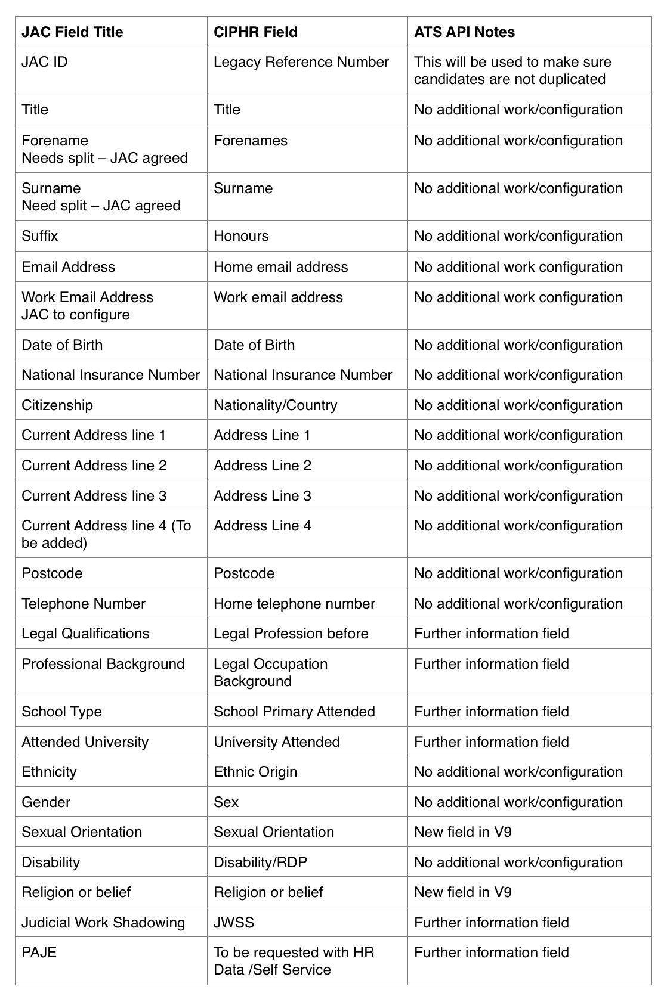

# Handover
## Overview

An authenticated JAC Staff user with the correct access level (role) will navigate the Admin app and select to 'Transfer handover data' to Judicial Office.

This will call a cloud function hosted on Google Cloud Platform.

Providing authentication checks out the cloud function will connect to and send data via the eHR ATS API.

All traffic will be from a known static IP (range) so that the eHR ATS API can be locked down to only fulfil requests from that address.

Results of the transfer will be presented on screen to the user.

This will be configured under two environments:
- Staging to test integration and new features
- Production for the live system.

## Data

The following fields will be transfered via the eHR ATS API

## eHR ATS API
*TODO: include details/link to API documentation*
