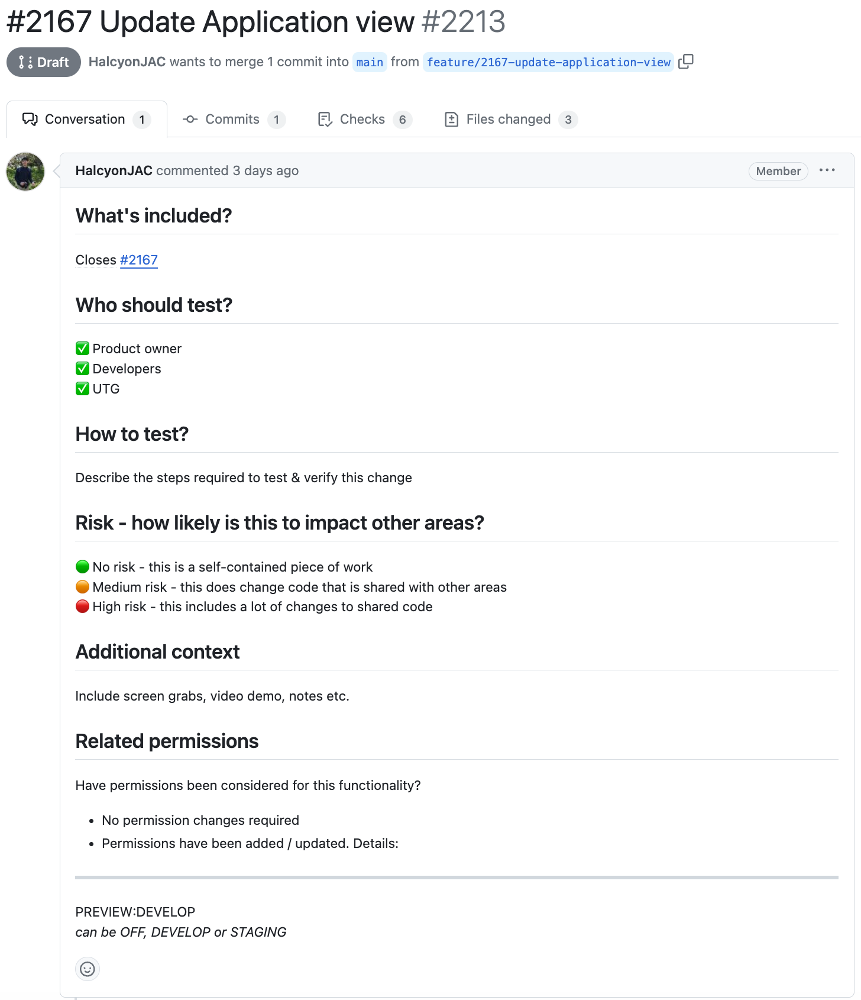

# User Acceptance Testing

User Acceptance Testing sessions are run every wednesday afternoon, giving JAC staff an opportunity to test new features and hotfixes and help to find any bugs.

Testing takes place on the Develop environment so, prior to the session, data will be setup on the Develop environment to help facilitate the session.

### Github Pull Request

Testing instructions are included in the GitHub pull request.

The following pieces of information are provided for the testers:

- Feature description
- Sequence of steps to test the feature
- Videos/Screenshots showing the feature to help the user test it
- Preview URL on the Development environment (usually in the form of a specific link to a page where data has been setup to facilitate the testing of the feature)

**Example GitHub pull request**

### Google Docs User Testing Document

Testing instructions are then copied from the pull requests into a single dedicated document per session. The documents are stored in Google Drive at the following location: https://drive.google.com/drive/u/0/folders/1Q9Q7JqpRWoy9P34G0UehGFxl_fRBrY2P

A user testing guidance document is also included at: https://docs.google.com/document/d/1ChV93vuGiVvLufgpun7QhM3Li-_RFZVmWaGGVZhkPmY/edit

### Testing Bugs
If any problems are found with the new feature a comment will be added to the GitHub issue which the Development Team will then pick up and action.